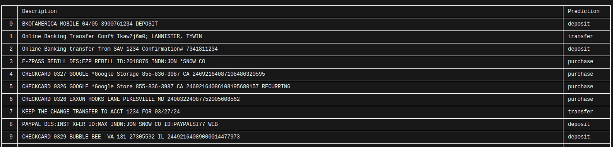

# CoPlexi

A model for text classification

This project contains a text classification pipeline to automatically categorize financial transactions (e.g., deposits, transfers, purchases).
It uses **Python, scikit-learn, gensim, and Word2Vec** for preprocessing and model training.

---

### 🚀 Getting Started

#### 1. Clone the repository

```bash
git clone git@github.com:JoaoMaiaBGM/coplexi.git
cd coplexi
```

#### 2. Create and activate a virtual environment

On Linux/Mac:

```bash
python3 -m venv .venv
source .venv/bin/activate
```

On Windows:

```bash
python -m venv .venv
.venv\Scripts\activate
```

#### 3. Install dependencies

```bash
pip install -r requirements.txt
```

---

### ⚡ Usage

#### Run pipeline

```bash
python src/pipeline.py
```

Expected output



The pipeline also generates a CSV file (`predictions.csv`) containing the descriptions and their predicted classifications.

---

### 📌 Requirements

- Python 3.9+
- pip
- virtualenv (recommended)
